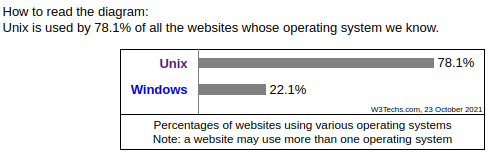
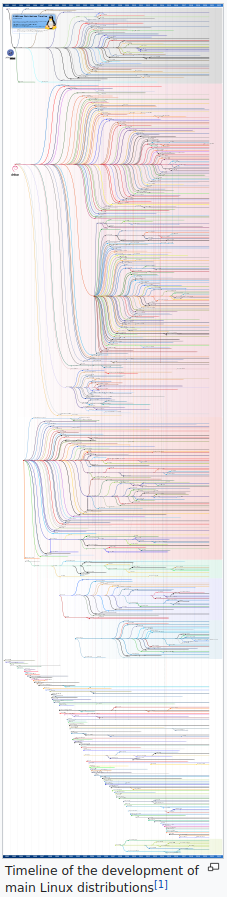
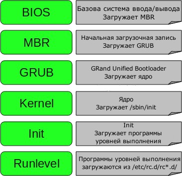
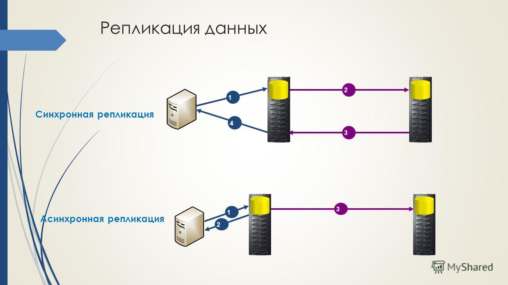
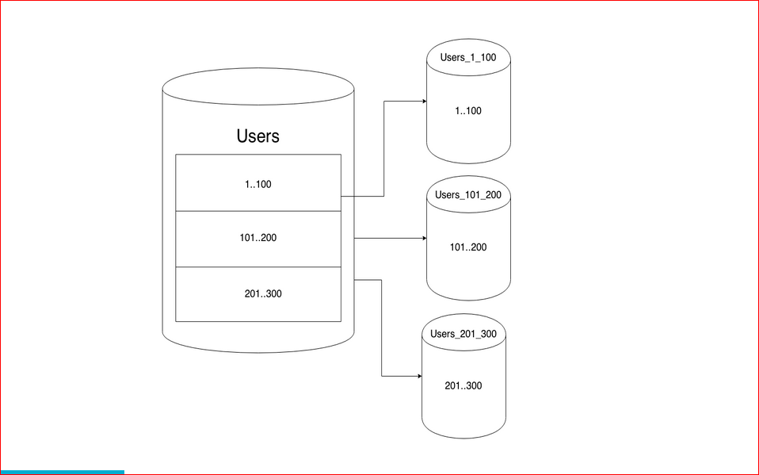
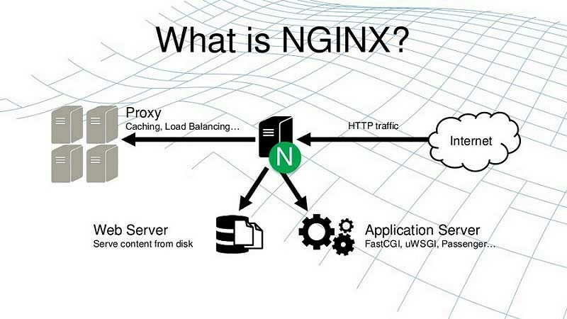

- [Почему Linux?](#org533b537)
- [Дистрибутивы Linux](#orgbd0ac71)
- [Какой же ставить на сервер?!](#org44cae6d)
  - [Debian-based](#org7949d5e)
  - [RedHat-based](#org1bb3b8f)
- [Debian-based](#orgf99c55f)
  - [Debian](#org6a0743e)
  - [Ubuntu](#orgc28d7ef)
- [RedHat-based](#org06b55b8)
  - [RedHat](#org8debe20)
  - [CentOS](#org39ee941)
  - [Fedora](#orga002597)
- [Другие](#org5ab6f9f)
  - [Gentoo](#org59c586a)
  - [Arch Linux](#org627545b)
- [Полезные команды](#orgf5ce7d9)
  - [Обновление системы](#org2b97635)
  - [Поиск пакета](#orgdecc004)
  - [Установка пакета](#orgff848c8)
- [initd, systemd](#org2187891)
- [BSD](#orgbfe91f1)
  - [FreeBSD/OpenBSD/NetBSD](#orge8d6671)
- [Доп. информация по Linux](#org319c996)
- [Работа с «удалённым» сервером. SSH](#org36e6a29)
- [SSH Ключи](#org04e9fda)
- [Добавление алиасов для SSH-хостов](#orgad0e5ab)
- [Python + SSH](#org4f7b436)
- [Ansible](#orgbee6f39)
- [Salt](#org10b8eea)
- [Rsync](#org6608e17)
- [screen / tmux](#orge954f78)
- [Проверка состояния сервера](#org74464dd)
- [Другие оболочки комнадной строки](#org0c2ce60)
- [PostgreSQL / MySQL / SQLite / NoSQL](#orgacbd9d6)
- [Репликация](#org0d88ed6)
- [Шардирование](#org72e2f49)
- [Nginx](#org9c9b4b4)
- [Nginx](#org0a98385)
- [Cron](#orgf4d1f27)
- [Бэкапы](#orgaf8f330)
- [Logrotate](#org6951b9e)
- [Дополнительная литература](#orgb4fd001)
- [Безопасность](#orge8f00c5)
- [Вопросы-ответы](#org97c187b)


<a id="org533b537"></a>

# Почему Linux?

[W3Techs](https://w3techs.com/technologies/overview/operating_system)  
  


<a id="orgbd0ac71"></a>

# Дистрибутивы Linux

**[их очень много!](https://upload.wikimedia.org/wikipedia/commons/8/83/Linux_Distribution_Timeline_27_02_21.svg)**  

  


<a id="org44cae6d"></a>

# Какой же ставить на сервер?!


<a id="org7949d5e"></a>

## Debian-based

-   deb-пакеты для установки программ
-   aptitude/apt — пакетный менеджер


<a id="org1bb3b8f"></a>

## RedHat-based

-   rpm-пакеты для установки программ
-   yum — пакетный менеджер


<a id="orgf99c55f"></a>

# Debian-based


<a id="org6a0743e"></a>

## Debian

Основная идея: он должен быть очень стабильный. В связи с этим версии пакетов будут довольно старые.  


<a id="orgc28d7ef"></a>

## Ubuntu

Задуман как user-friendly дистрибутив, но кто-то даже ставит его на продакшен-сервера. Не так заморочены за стабильность.  


<a id="org06b55b8"></a>

# RedHat-based


<a id="org8debe20"></a>

## RedHat

Коммерческий дистрибутив. Много дополнительных плюшек для стабильности и безопасности за платную подписку.  


<a id="org39ee941"></a>

## CentOS

Бесплатная версия RedHat OS. Стремятся быть стабильными, в этом похожи на Debian.  


<a id="orga002597"></a>

## Fedora

User-friendly версия RedHat для рабочих станций.  


<a id="org5ab6f9f"></a>

# Другие


<a id="org59c586a"></a>

## Gentoo

Дистрибутив, где все (почти все) программы компилируются из исходных кодов с целью полной оптимизации под тот процессор, на котором программы будут работать.  


<a id="org627545b"></a>

## Arch Linux

Дистрибутив для опытных пользователей. Стремятся устанавливать только самые последние версии программ и библиотек.  


<a id="orgf5ce7d9"></a>

# Полезные команды


<a id="org2b97635"></a>

## Обновление системы

-   deb: apt-get update && apt-get upgrade
-   rpm: yum update


<a id="orgdecc004"></a>

## Поиск пакета

-   deb: apt-cache search <request>
-   rpm: yum search <request>


<a id="orgff848c8"></a>

## Установка пакета

-   deb: apt-get install <package>
-   rpm: yum install <package>


<a id="org2187891"></a>

# initd, systemd

<span class="underline"><span class="underline">[статья про systemd](https://linux-notes.org/pishem-systemd-unit-fajl/?ysclid=l3zhnz2h2c)</span></span>  

  


<a id="orgbfe91f1"></a>

# BSD


<a id="orge8d6671"></a>

## FreeBSD/OpenBSD/NetBSD

  


<a id="org319c996"></a>

# Доп. информация по Linux

-   <span class="underline"><span class="underline">[Stepik: Введение в Linux](https://stepik.org/course/73/syllabus)</span></span>
-   Брайан У. Керниган, Роб Пайк «Unix. Программное окружение»


<a id="org36e6a29"></a>

# Работа с «удалённым» сервером. SSH

```shell
ssh -p 22 resu@host
```

```shell
scp -P 22 resu@host:/path/to/file ~/
```

```shell
scp -P 2220 \
    ~/file resu@host:/path/to/file
```


<a id="org04e9fda"></a>

# SSH Ключи

-   Сгенерировать ключи *~/.ssh/id\_rsa* и *~/.ssh/id\_rsa.pub* для своего хоста (пользователя)  
    
    ```shell
    ssh-keygen
    ```
-   Отправить свой публичный ключ на удалённый сервер (добавит в *~/.ssh/authorized\_keys*)  
    
    ```shell
    ssh-copy-id user@host
    ```
    
    **Никогда не публикуйте свой приватный ключ!** *~/.ssh/id\_rsa*


<a id="orgad0e5ab"></a>

# Добавление алиасов для SSH-хостов

    Host foo
       Hostname 192.168.250.23
       User root
    Host bar
       Hostname 192.168.250.34
       User username
       Port 2221

В файл *~/.ssh/config* можно прописать алиасы для часто используемых хостов и сильно облегчить себе жизнь. Пароль прописать нельзя.  

```shell
ssh bar
```


<a id="org4f7b436"></a>

# Python + SSH

<span class="underline"><span class="underline">[Paramiko](https://www.paramiko.org/)</span></span>  

```python
from paramiko.client import SSHClient
client = SSHClient()
client.load_system_host_keys()
client.connect(
    "ssh.pvavilin.ru", username="root"
)
stdin, stdout, stderr = (
    client.exec_command("ls -l")
)
print(stdout.read().decode('utf-8'))
```


<a id="orgbee6f39"></a>

# Ansible

<span class="underline"><span class="underline">[Официальная страница](https://docs.ansible.com/ansible/latest/index.html)</span></span>  

    ---
    - name: My task
      hosts: all
      tasks:
         - name: Leaving a mark
           command: \
           "touch /tmp/ansible_was_here"

Запускаем список задач:  

```shell
ansible-playbook mytask.yaml
```


<a id="org10b8eea"></a>

# Salt

<span class="underline"><span class="underline">[Официальная страница](https://docs.saltproject.io/en/getstarted/)</span></span>  
В отличие от Ansible, все сервера-клиенты слушают мастер-сервер и ждут от него указаний. Это позволяет, например, ограничить на клиентах набор допустимых команд.  


<a id="org6608e17"></a>

# Rsync

Позволяет ускорить передачу данных с одного сервера на другой за счёт подсчёта контрольных сумм уже существующих данных. То есть, если на сервере есть данные за вчерашний день, то мы можем "докачать" блоки данных которые поменялись за сегодня.  

```shell
rsync -av source destination
```

Можно использовать и на локальной машине.  


<a id="orge954f78"></a>

# screen / tmux

При работе с удалённым сервером часто нужно запустить несколько вкладок терминала. screen/tmux позволяют открыть несколько сессий командной строки в рамках одного подключения (можно и на локальной машине). Плюсом если у вас отвалится SSH-подключение, то при этом ваш сеанс работы с screen/tmux не будет потерян в отличие от работы в Bash напрямую. Благодаря последней возможности можно запускать фоновые сервисы без написания специальных скриптов.  

-   **<span class="underline"><span class="underline">[screen](https://www.gnu.org/software/screen/)</span></span>:** старый и вездесущий.
-   **<span class="underline"><span class="underline">[Tmux](https://www.ocf.berkeley.edu/~ckuehl/tmux/)</span></span>:** более user-friendly.


<a id="org74464dd"></a>

# Проверка состояния сервера

-   **uptime:** покажет сколько времени сервер живёт с момента последней перезагрузки. Покажет загрузку процессоров задачами (Load Average)
-   **w:** покажет запущенные сеансы пользователей
-   **top:** покажет статистику по процессам
-   **htop:** user-friendly *top* (install)
-   **iotop:** покажет загрузку ввода/вывода (install)
-   **lsof:** показывает <span class="underline"><span class="underline">[информацию](https://habr.com/ru/company/ruvds/blog/337934/?ysclid=l3y0lg86um)</span></span> об открытых «файлах»
-   **df -h:** покажет состояние примонтированных файловых систем
-   **free -m:** покажет состояние оперативной памяти и файла подкачки
-   **date:** покажет текущее время на сервере


<a id="org0c2ce60"></a>

# Другие оболочки комнадной строки

*Bash* — это лишь одна из множества <span class="underline">оболочек командной строки</span>, но давно стал стандартом де-факто. Официальным стандартом является очень простая оболочка *sh*.\newline{}Кроме *Bash* пользуется популярностью оболочка *zsh* (в MacOS стандартная оболочка).\newline{} *Bash* и *zsh* совместимы с *sh* — это значит что базовый синтаксис у них соответствует синтаксису *sh*.  


<a id="orgacbd9d6"></a>

# PostgreSQL / MySQL / SQLite / NoSQL

-   PostgreSQL и MySQL (MariaDB) обе профессиональные RDBMS. PostgreSQL может быть чуть сложнее в настройке из-за бóльшего набора возможностей.
-   SQLite — подходит только для очень маленьких задач или для изучения стандарта SQL.
-   NoSQL огромное множество. Выбор делается в соответствии с <span class="underline"><span class="underline">[теоремой CAP](https://ru.wikipedia.org/wiki/%25D0%25A2%25D0%25B5%25D0%25BE%25D1%2580%25D0%25B5%25D0%25BC%25D0%25B0_CAP)</span></span>


<a id="org0d88ed6"></a>

# Репликация

  


<a id="org72e2f49"></a>

# Шардирование

  


<a id="org9c9b4b4"></a>

# Nginx

В интернете очень много статики!  

  


<a id="org0a98385"></a>

# Nginx

  


<a id="orgf4d1f27"></a>

# Cron

    SHELL=/bin/sh
    PATH=/usr/local/sbin:/usr/local/bin:/sbin:/bin
    
    # Example of job definition:
    # .---------------- minute (0-59)
    # |  .------------- hour (0-23)
    # |  |  .---------- day of month (1-31)
    # |  |  |  .------- month (1-12) OR jan,feb,mar,apr
    # |  |  |  |  .---- day of week (0-6) (Sunday=0 or 7)
    # |  |  |  |  |       OR sun,mon,tue,wed,thu,fri,sat
    # |  |  |  |  |
    # m h dom mon dow user command
    17 * * * *  root  <command>
    25 6 * * *  root  <command>
    47 6 * * 7  root  <command>
    52 6 1 * *  root  <command>

```shell
man 5 crontab
```

```shell
crontab -e
```


<a id="orgaf8f330"></a>

# Бэкапы

> Админы делятся на тех, кто делает бэкап и на тех, кто еще не делает.  

<span class="underline"><span class="underline">[Bacula](https://www.bacula.org/)</span></span>  

-   Полный бэкап (например, раз в месяц)
-   Инкрементальный бэкап (например, каждый день)


<a id="org6951b9e"></a>

# Logrotate

<span class="underline"><span class="underline">[Документация](https://www.redhat.com/sysadmin/setting-logrotate)</span></span>  
Подчищает старые лог-файлы.  


<a id="orgb4fd001"></a>

# Дополнительная литература

Если вам стал интересен какой-то из пунктов, то пишите запрос на доп. литературу в #XX\_offtopic или #XX\_library \Winkey[][green!60!white]  


<a id="orge8f00c5"></a>

# Безопасность

-   <span class="underline"><span class="underline">[Генерируйте пароли](https://www.cyberciti.biz/faq/generating-random-password/)</span></span> при помощи *pwgen* или *makepasswd*
-   Проверяйте пароли на стойкость с помощью *cracklib-check*
-   Никогда не работайте под **root**-ом, используйте *sudo*
-   Не пишите файлы в *shared* директории типа */tmp*
-   Лучше использовать нестандартный порт для SSH
-   Процессы лучше заворачивать в docker
-   Безопасность в Linux очень обширная тема. Специалисты по Linux-безопасности крайне востребованы.


<a id="org97c187b"></a>

# Вопросы-ответы


